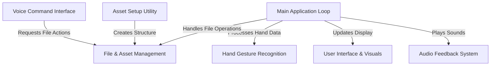
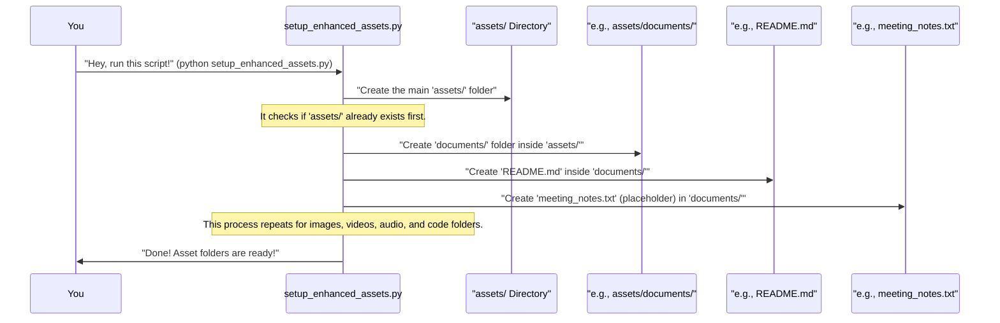
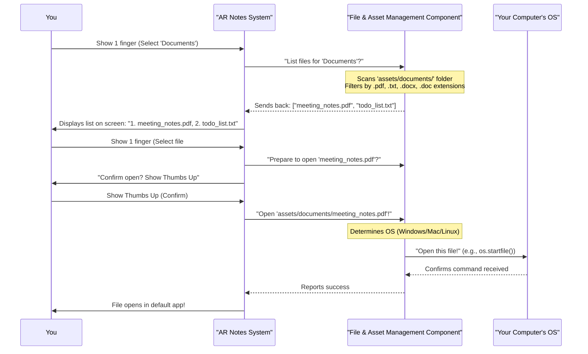
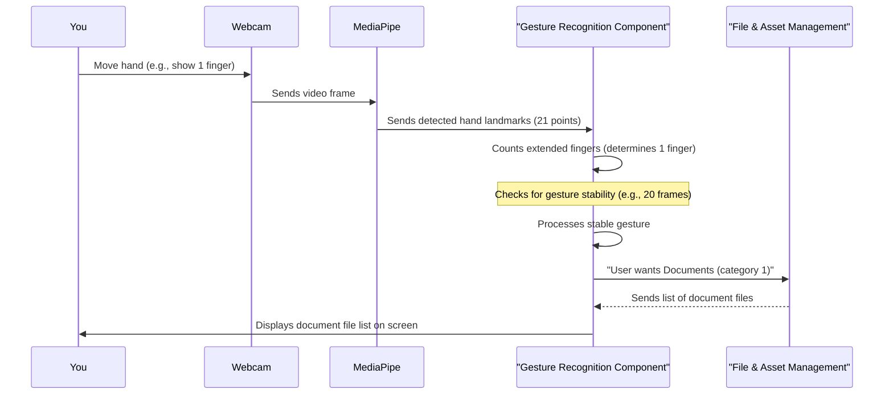
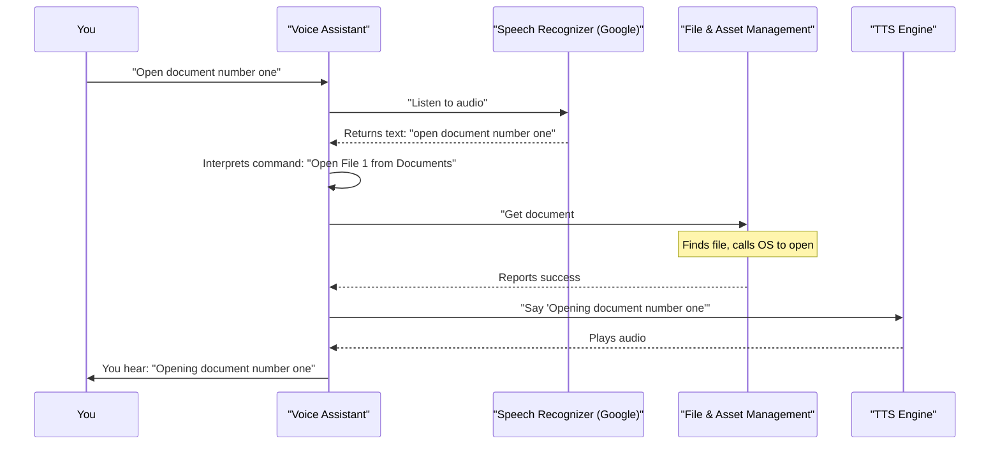
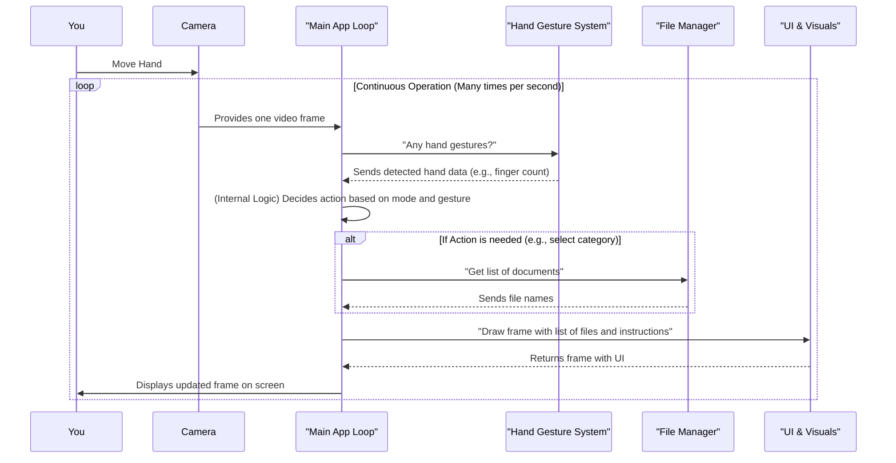
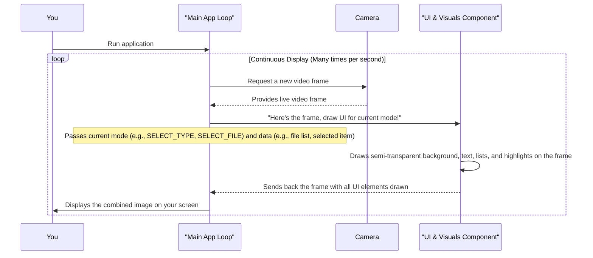
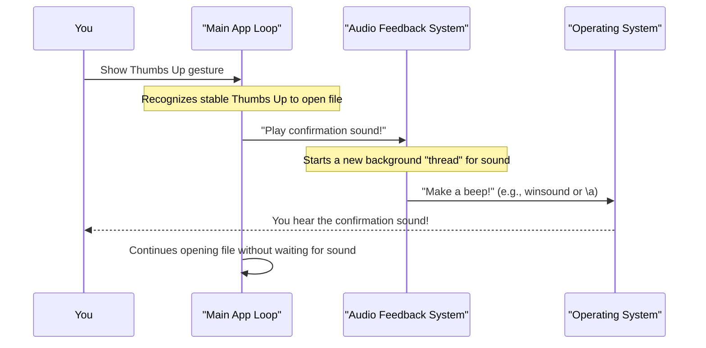

# Tutorial: ar-notes-opener

This project is an **augmented reality (AR) notes system** that lets you *interact with your files using natural hand gestures*. It allows users to **browse documents, images, videos, audio, and code** by showing a specific number of fingers for categories and file selection, and then *open chosen files* with a "thumbs up" gesture, all while seeing a live camera view with a clean on-screen interface and getting audio confirmations.


## Visual Overview



## Chapters

1. [Asset Setup Utility
](01_asset_setup_utility_.md)
2. [File & Asset Management
](02_file___asset_management_.md)
3. [Hand Gesture Recognition
](03_hand_gesture_recognition_.md)
4. [Voice Command Interface
](04_voice_command_interface_.md)
5. [Main Application Loop
](05_main_application_loop_.md)
6. [User Interface & Visuals
](06_user_interface___visuals_.md)
7. [Audio Feedback System
](07_audio_feedback_system_.md)

# Chapter 1: Asset Setup Utility

Welcome to the `ar-notes-opener` project! Imagine you have a new digital notebook, but instead of writing with a pen, you use hand gestures. Before you can start writing (or, in our case, organizing your digital files), you need a place to put everything. That's exactly where our first helper tool comes in: the **Asset Setup Utility**.

### What Problem Does It Solve?

Think of your computer files – documents, photos, videos, music, code. You probably have them scattered in different folders, right? For our `ar-notes-opener` system to work smoothly and find your files easily with gestures, it needs them organized in a very specific way.

If you had to create all those folders yourself (`documents`, `images`, `videos`, `audio`, `code`), it would be a bit tedious. You might even make a typo, and then the system wouldn't find your files! This is where the **Asset Setup Utility** shines.

**The big idea:** Instead of you manually creating folders like `assets/documents`, `assets/images`, etc., this utility does it for you automatically, so you can just focus on adding your files later!

### How to Use the Asset Setup Utility

This utility is a special script designed to get your project ready. It's like having a little helper that builds the foundation for your files.

Here’s how incredibly simple it is to use:

1.  **Open your command prompt or terminal.** This is where you type commands to your computer.
2.  **Navigate to your `ar-notes-opener` project folder.**
3.  **Run the setup command:**

    ```bash
    python setup_enhanced_assets.py
    ```

    This single line of code tells your computer to run the "Asset Setup Utility" script (`setup_enhanced_assets.py`).

**What happens when you run it?**

The script will quickly work its magic. You'll see a message like this:

```
Setting up asset folders and sample files...
Asset folders and sample files created successfully.
```

After it finishes, if you look inside your `ar-notes-opener` project folder, you'll now find a new main folder called `assets/`. Inside `assets/`, you'll see several other folders, each for a different type of file, along with special `README.md` files and some simple placeholder files.

Here's what the `assets` folder will look like:

```
assets/
├── documents/     (For your PDFs, Word files, text notes)
├── images/        (For your JPGs, PNGs, screenshots)
├── videos/        (For your MP4s, AVI clips)
├── audio/         (For your MP3s, WAV sounds)
└── code/          (For your Python scripts, HTML files)
```

Each of these subfolders also gets a `README.md` file (a simple text file that explains what kind of files go there) and a few dummy files so you can see how it works right away.

### How It Works Under the Hood (A Simple Peek)

Let's understand what's happening when you run that single command. It's like asking a construction worker (our script) to build a small house (our `assets` folder structure).



As you can see, the `setup_enhanced_assets.py` script systematically creates each required folder and places helpful files inside them. This ensures that the main AR Notes system, which we'll talk about later, knows exactly where to look for your content.

### A Closer Look at the Code

Let's peek at the `setup_enhanced_assets.py` file to see the core ideas behind how it builds these folders. Don't worry about understanding every detail; we'll focus on the main actions.

The script uses a special tool in Python called `os` (short for "operating system") to interact with folders and files on your computer.

1.  **Creating the main `assets` folder:**

    ```python
    import os

    def main():
        print("Setting up asset folders and sample files...")
        os.makedirs('assets', exist_ok=True) # Create 'assets' folder
        # ... rest of the code ...
    ```

    -   `import os`: This line brings in the `os` tool.
    -   `os.makedirs('assets', exist_ok=True)`: This is the key part. It tells your computer to create a folder named `assets`. The `exist_ok=True` part is a safety net; it means "if the folder already exists, don't worry, just continue."

2.  **Creating subfolders and READMEs:**

    The script has a helper function, `create_asset_folder`, that does this for each category:

    ```python
    # Inside setup_enhanced_assets.py
    def create_asset_folder(folder_name, description, extensions):
        folder_path = os.path.join('assets', folder_name)
        os.makedirs(folder_path, exist_ok=True) # Create the specific category folder

        readme_fp = os.path.join(folder_path, "README.md")
        with open(readme_fp, 'w', encoding='utf-8') as f:
            f.write(f"# {folder_name.capitalize()} Folder\n\n")
            # ... writes description and supported extensions ...
    ```

    -   `os.path.join('assets', folder_name)`: This smartly combines names like `'assets'` and `'documents'` to create the correct path, like `'assets/documents'`. This works correctly on all types of computers (Windows, Mac, Linux).
    -   `os.makedirs(folder_path, exist_ok=True)`: Again, this creates the specific folder (e.g., `documents`).
    -   `with open(readme_fp, 'w', encoding='utf-8') as f:`: This opens a new file named `README.md` inside the new folder. The `'w'` means "write" (create if it doesn't exist, or clear it if it does).
    -   `f.write(...)`: This writes the helpful text into the `README.md` file.

3.  **Adding sample files:**

    Another small helper function adds simple text files as placeholders:

    ```python
    # Inside setup_enhanced_assets.py
    def create_sample_file(folder_name, filename, content):
        full_path = os.path.join('assets', folder_name, filename)
        with open(full_path, 'w', encoding='utf-8') as f:
            f.write(content) # Writes the placeholder text

    # Example usage for documents folder in main()
    # create_sample_file("documents", "meeting_notes.txt", "# Meeting Notes...")
    # create_sample_file("documents", "project_proposal.txt", "# Project Proposal...")
    ```

    -   This is similar to how the `README.md` is created, but it creates files like `meeting_notes.txt` with some example content. These are just there to show you how the system will look for files. You can delete them and add your own later!

### Conclusion

In this chapter, we learned about the **Asset Setup Utility**, a super helpful tool that automatically builds the organized folder structure for your `ar-notes-opener` project. Instead of manually creating `documents/`, `images/`, `videos/`, `audio/`, and `code/` folders, you simply run `python setup_enhanced_assets.py`, and it does all the work for you. This ensures that the main system can easily find and manage your content.

Now that our file structure is perfectly set up, we're ready to dive into how the system actually manages and uses these files.

Let's move on to [Chapter 2: File & Asset Management](02_file___asset_management_.md)!

---

<sub><sup>Generated by [AI Codebase Knowledge Builder](https://github.com/The-Pocket/Tutorial-Codebase-Knowledge).</sup></sub> <sub><sup>**References**: [[1]](https://github.com/IshanG2111/ar-notes-opener/blob/01303747d8ac5941c6586d07a83304bf99357a11/README.md), [[2]](https://github.com/IshanG2111/ar-notes-opener/blob/01303747d8ac5941c6586d07a83304bf99357a11/assets/audio/README.md), [[3]](https://github.com/IshanG2111/ar-notes-opener/blob/01303747d8ac5941c6586d07a83304bf99357a11/assets/code/README.md), [[4]](https://github.com/IshanG2111/ar-notes-opener/blob/01303747d8ac5941c6586d07a83304bf99357a11/assets/documents/README.md), [[5]](https://github.com/IshanG2111/ar-notes-opener/blob/01303747d8ac5941c6586d07a83304bf99357a11/assets/images/README.md), [[6]](https://github.com/IshanG2111/ar-notes-opener/blob/01303747d8ac5941c6586d07a83304bf99357a11/assets/videos/README.md), [[7]](https://github.com/IshanG2111/ar-notes-opener/blob/01303747d8ac5941c6586d07a83304bf99357a11/setup_enhanced_assets.py)</sup></sub>

---

<sub><sup>Generated by [AI Codebase Knowledge Builder](https://github.com/The-Pocket/Tutorial-Codebase-Knowledge).</sup></sub>

# Chapter 2: File & Asset Management

Welcome back! In [Chapter 1: Asset Setup Utility](01_asset_setup_utility_.md), we learned how to use a helper tool to automatically build the `assets/` folder structure, which is like setting up the empty shelves in our digital library. Now, it's time to understand how our `ar-notes-opener` system actually *uses* those shelves – how it finds your notes, images, videos, and more, and then helps you open them. This is the heart of **File & Asset Management**.

### What Problem Does It Solve?

Imagine you're in a real library. Once the shelves are set up (thanks to Chapter 1!), you need a way to:
1.  **Know what books (files) are on each shelf (folder).**
2.  **Quickly find the book you're looking for.**
3.  **"Open" the book** (or, in our case, launch the file with the right program).

Our `ar-notes-opener` system needs to do the same thing for your digital files. It needs to be smart enough to look inside folders like `assets/documents/`, `assets/images/`, etc., automatically list the files inside, know what kind of file each is (a PDF? a JPG?), and then open it when you tell it to with a gesture.

**The big idea:** This component is the project's organized library and its librarian! It constantly knows what files you have, where they are, and how to get them ready for you to "read" (open).

### How It Works for You

The best part about the File & Asset Management system is that it's mostly "invisible" to you. You don't need to write any code or configure complicated settings to make it work.

Here’s all you need to do, continuing from Chapter 1:

1.  **Place your files:** After running `python setup_enhanced_assets.py` (from Chapter 1), you'll have folders like `assets/documents`, `assets/images`, etc. Simply copy and paste your actual files (e.g., your PDF notes, your vacation photos, your favorite MP3s) into the correct folders.

    ```
    assets/
    ├── documents/
    │   ├── important_meeting.pdf
    │   └── recipe_book.txt
    ├── images/
    │   └── family_photo.jpg
    └── videos/
        └── vacation_clip.mp4
    # ... and so on for audio/ and code/
    ```

2.  **Run the `ar-notes-opener` system:**

    ```bash
    python enhanced_gesture_system.py
    ```

That's it! When you run the system, it automatically scans these folders. When you select a category with your gestures (e.g., show 1 finger for "Documents"), the system immediately knows which files are in the `documents` folder, lists them for you, and prepares to open them when you make the "Thumbs Up" gesture.

You can add or remove files from these `assets` folders at any time, even while the system is running! The system is designed to automatically detect these changes the next time you browse a category, without needing to restart the application or change any code.

### Key Concepts Behind the Scenes

Let's peek behind the curtain to understand how this "smart librarian" works.

1.  **Categorization by Folder and Extension:**
    The system uses the folder names (`documents`, `images`, etc.) as the primary way to group files. But it also double-checks the **file extension** (like `.pdf`, `.png`, `.mp4`) to make sure only supported files appear in each category list. This prevents, for example, a `.mp3` file from showing up in your `documents` list.

    ```python
    # Inside enhanced_gesture_system.py, in the __init__ method
    self.categories = {
        1: {"name": "Documents", "folder": "documents", "extensions": ['.pdf', '.txt', '.docx', '.doc']},
        2: {"name": "Images", "folder": "images", "extensions": ['.jpg', '.jpeg', '.png', '.gif', '.bmp']},
        # ... more categories like Videos, Audio, Code
    }
    ```
    This `self.categories` dictionary is the system's "catalog." It tells the program: "For category 1 (Documents), look in the `documents` folder, and only list files with these specific extensions."

2.  **Dynamic File Listing:**
    When you choose a category with your fingers, the system doesn't rely on a pre-saved list. Instead, it goes and checks the folder *right then and there*. This is why you can add or remove files while the system is running, and the changes appear instantly.

    Here's a simplified look at the function that does this:

    ```python
    # Inside enhanced_gesture_system.py
    import os # Needed to work with files and folders

    def get_files_for_category(self, category_num):
        # 1. Get the folder path (e.g., "assets/documents")
        category_info = self.categories[category_num]
        folder_path = os.path.join(self.assets_dir, category_info['folder'])

        # 2. Check if the folder exists, just in case
        if not os.path.exists(folder_path):
            return [] # Return an empty list if folder is missing

        # 3. List all files in the folder and filter by allowed extensions
        files = []
        for f in os.listdir(folder_path): # List everything in the folder
            # Get the file's extension (e.g., ".pdf" from "my_notes.pdf")
            file_extension = os.path.splitext(f)[1].lower()
            # If the extension is in our allowed list, add the file
            if file_extension in category_info['extensions']:
                files.append(f)

        return sorted(files) # Return the list, sorted alphabetically
    ```
    This `get_files_for_category` function is called every time you select a category. It's like the librarian quickly walking to the "documents" shelf, looking at every "book," checking its "type," and making a list for you.

3.  **Cross-Platform File Opening:**
    Once you've selected a file and made the "Thumbs Up" gesture, the system needs to tell your computer to open that file using its default program (e.g., Adobe Reader for a PDF, your web browser for an HTML file). Different operating systems (Windows, macOS, Linux) have different commands for this. The system handles these differences automatically.

    ```python
    # Inside enhanced_gesture_system.py
    import platform # To know which operating system we are on
    import subprocess # To run commands on the computer

    def open_file(self, filename):
        # ... (code to get the full_file_path, similar to above) ...
        full_file_path = "assets/documents/meeting_notes.txt" # Example path

        # This part ensures the right command is used for your computer
        try:
            if platform.system() == "Windows":
                os.startfile(full_file_path) # Windows command
            elif platform.system() == "Darwin": # macOS
                subprocess.Popen(["open", full_file_path]) # macOS command
            else: # Linux and other Unix-like systems
                subprocess.Popen(["xdg-open", full_file_path]) # Linux command
            print(f"Opened file: {filename}")
            return True
        except Exception as e:
            print(f"Error opening file: {e}")
            return False
    ```
    This function is critical because it's the bridge between our gesture system and your computer's native ability to open files.

### The Flow: From Your Gesture to an Open File

Let's visualize the entire process for opening a file using File & Asset Management:



This diagram shows how the File & Asset Management component acts as the middleman, taking your requests (via gestures) and translating them into actions on your computer's files.

### Conclusion

In this chapter, we explored the **File & Asset Management** component, which is like the smart librarian of your `ar-notes-opener` system. We learned how it:
*   Organizes your files into categories based on folders and file types.
*   Automatically detects and lists files dynamically, meaning you can add or remove files without changing any code.
*   Opens selected files using the correct commands for your computer's operating system.

With our files now organized and manageable, it's time to dive into how the system understands your gestures in the first place!

Let's move on to [Chapter 3: Hand Gesture Recognition](03_hand_gesture_recognition_.md)!

---

<sub><sup>Generated by [AI Codebase Knowledge Builder](https://github.com/The-Pocket/Tutorial-Codebase-Knowledge).</sup></sub> <sub><sup>**References**: [[1]](https://github.com/IshanG2111/ar-notes-opener/blob/01303747d8ac5941c6586d07a83304bf99357a11/README.md), [[2]](https://github.com/IshanG2111/ar-notes-opener/blob/01303747d8ac5941c6586d07a83304bf99357a11/assets/audio/README.md), [[3]](https://github.com/IshanG2111/ar-notes-opener/blob/01303747d8ac5941c6586d07a83304bf99357a11/assets/code/README.md), [[4]](https://github.com/IshanG2111/ar-notes-opener/blob/01303747d8ac5941c6586d07a83304bf99357a11/assets/documents/README.md), [[5]](https://github.com/IshanG2111/ar-notes-opener/blob/01303747d8ac5941c6586d07a83304bf99357a11/assets/images/README.md), [[6]](https://github.com/IshanG2111/ar-notes-opener/blob/01303747d8ac5941c6586d07a83304bf99357a11/assets/videos/README.md), [[7]](https://github.com/IshanG2111/ar-notes-opener/blob/01303747d8ac5941c6586d07a83304bf99357a11/enhanced_gesture_system.py), [[8]](https://github.com/IshanG2111/ar-notes-opener/blob/01303747d8ac5941c6586d07a83304bf99357a11/setup_enhanced_assets.py)</sup></sub>

# Chapter 3: Hand Gesture Recognition

Welcome back, digital explorer! In [Chapter 1: Asset Setup Utility](01_asset_setup_utility_.md), we built the perfect home for your files. Then, in [Chapter 2: File & Asset Management](02_file___asset_management_.md), we learned how the system acts like a smart librarian, keeping track of all your documents, images, and more.

But how do you *tell* this smart librarian what you want? How do you pick a category or select a file without touching a mouse or keyboard? This is where **Hand Gesture Recognition** comes in – it's how your `ar-notes-opener` system understands what your hands are "saying"!

### What Problem Does It Solve?

Imagine you're trying to communicate with a friend who doesn't speak your language. You'd probably use hand gestures, right? Pointing, counting on your fingers, thumbs up!

Our `ar-notes-opener` system faces a similar challenge. It needs to "see" your hands and "understand" your movements to control everything. This component solves the problem of translating your natural hand movements into specific commands for the application.

**The big idea:** Hand Gesture Recognition is the system's "eyes" and "interpreter." It watches your hands, figures out what gesture you're making (like how many fingers are up), and then turns that into a command for the program, allowing you to select categories, files, and confirm actions simply by moving your hand!

### How to Use Hand Gestures

Using gestures with the `ar-notes-opener` system is intuitive because it mimics how you already use your hands to count or confirm things.

1.  **Launch the System:** Make sure your `assets` folders are set up (from Chapter 1) and your files are placed inside (from Chapter 2). Then, just run:
    ```bash
    python enhanced_gesture_system.py
    ```
    Your computer's camera will turn on, showing you a mirrored view of yourself with information overlaid on the screen.

2.  **Make Gestures:**
    The system will constantly watch your hand (specifically your right hand, for simplicity) and detect gestures. Here are the main ones:

    | Gesture                      | What it Does                                 |
    | :--------------------------- | :------------------------------------------- |
    | **1 Finger** 👆              | Selects **Documents** category or **File #1** |
    | **2 Fingers** ✌️             | Selects **Images** category or **File #2**   |
    | **3 Fingers** 🤟             | Selects **Videos** category or **File #3**   |
    | **4 Fingers** 🖖             | Selects **Audio** category or **File #4**    |
    | **5 Fingers** 🖐️             | Selects **Code** category or **File #5**     |
    | **Thumbs Up** 👍             | **Confirms** opening a file                  |
    | **Fist** ✊ (Future Feature) | **Cancels** and goes back to previous screen |

    When you make a gesture, the system needs to see it clearly for a short time (a few moments) to ensure you really mean it and it wasn't just a quick movement. This is called "stability." After you make a gesture, there's also a small "cooldown" period before you can make another one, preventing accidental rapid-fire selections.

### Key Concepts Behind the Scenes

Let's peek under the hood to see how the system "sees" and "understands" your hands.

1.  **Computer Vision: The System's "Eyes"**
    Just like your eyes see the world, "computer vision" allows a computer to "see" and interpret images and videos. For `ar-notes-opener`, this means using your webcam to capture live video of your hands.

2.  **Hand Tracking: Mapping Your Hand**
    The system uses a powerful tool called **MediaPipe Hands** (from Google). Think of it like a special pair of glasses that can instantly find your hand in the video feed and then draw an invisible "skeleton" on it.

    This "skeleton" is made up of **21 tiny points** (called "landmarks") on your hand, like the tip of each finger, your knuckles, and your wrist. MediaPipe tracks these points with incredible accuracy, even as your hand moves.

    ```mermaid
    graph TD
        A[Webcam Captures Video] --> B(MediaPipe Hand Module)
        B --> C{Detects Hand in Frame}
        C --> D[Tracks 21 Hand Landmarks]
        D --> E[Provides Landmark Data to System]
        E --> F[System Uses Data for Gestures]
    ```
    This flow shows how the raw video data is processed to give us the detailed hand information.

3.  **Gesture Translation: Understanding What You Mean**
    Once the system has the 21 landmarks, it's like having a detailed map of your hand. Now, it needs to interpret what those points mean.

    *   **Counting Fingers:** To count fingers, the system checks the position of the fingertip landmark compared to a lower landmark on the same finger (the "pip" joint). If the tip is higher (or further out for the thumb), the finger is considered "extended" or "up."
        ```python
        # Simplified logic for one finger (e.g., Index finger)
        # From enhanced_gesture_system.py
        def count_fingers(self, landmarks):
            count = 0
            # Check if Index finger tip is above its knuckle
            if landmarks[8].y < landmarks[6].y: # 8 is index fingertip, 6 is index pip
                count += 1
            # ... (similar checks for other fingers and thumb) ...
            return count
        ```
        This snippet shows the core idea: comparing the Y-position of a finger's tip to its knuckle to see if it's extended.

    *   **Detecting Thumbs Up:** For a "thumbs up," the system checks if the thumb is pointing upwards and if the other fingers are curled down (or "closed").
        ```python
        # Simplified logic for Thumbs Up
        # From enhanced_gesture_system.py
        def detect_thumbs_up(self, landmarks):
            # Is thumb tip higher than its base?
            thumb_up = landmarks[4].y < landmarks[3].y # 4 is thumb tip, 3 is thumb pip
            # Are other fingers curled down? (simplified check)
            others_down = True # Assume true for simplicity
            return thumb_up and others_down
        ```
        Here, we check the thumb's orientation and ensure other fingers aren't extended.

### The Flow: From Your Hand Movement to a Command

Let's visualize how your gesture becomes an action in the system:


This diagram illustrates the journey from your physical hand movement to the system displaying file choices. The `GestureSystem` is constantly running in the background, making this all possible.

### Under the Hood: The Main Loop

The core of the `enhanced_gesture_system.py` file is a continuous loop that does these steps over and over again, many times per second:

1.  **Capture Frame:** Get a single image (frame) from the webcam.
2.  **Process Hand:** Send the frame to MediaPipe to find and track your hand landmarks.
3.  **Detect Gestures:** Use the landmark data to count fingers or detect a "thumbs up."
4.  **Check Stability:** See if the detected gesture has been consistent for a certain number of frames. This prevents flickering or accidental triggers.
5.  **Process Action:** If the gesture is stable and cooldown allows, trigger the appropriate action (e.g., switch category, select file, open file).
6.  **Display:** Add the user interface (like file lists and instructions) on top of the camera feed and show it to you.

Here's a simplified look at the main loop:

```python
# From enhanced_gesture_system.py
class EnhancedGestureSystem:
    # ... __init__ and other methods ...

    def process_gesture(self, finger_count, thumbs_up):
        current_time = time.time()
        # 1. Cooldown check: Prevents rapid-fire actions
        if current_time - self.last_gesture_time < self.gesture_cooldown:
            return

        # 2. State-based actions
        if self.current_mode == "SELECT_TYPE":
            if finger_count in self.categories and self.stability_frames >= self.required_stability:
                # User showed a stable finger count corresponding to a category
                self.selected_category = finger_count
                self.file_list = self.get_files_for_category(finger_count) # Get files (Chapter 2!)
                self.current_mode = "SELECT_FILE" # Change to next mode
                self.last_gesture_time = current_time # Reset cooldown

        elif self.current_mode == "SELECT_FILE":
            if 1 <= finger_count <= len(self.file_list) and self.stability_frames >= self.required_stability:
                # User showed a stable finger count for a file
                self.selected_file_index = finger_count - 1
                self.current_mode = "CONFIRM" # Ask for confirmation
                self.last_gesture_time = current_time

        elif self.current_mode == "CONFIRM":
            if thumbs_up:
                # User showed a stable Thumbs Up
                filename = self.file_list[self.selected_file_index]
                self.open_file(filename) # Open file (Chapter 2!)
                # Reset system after opening
                self.current_mode = "SELECT_TYPE"
                # ... reset other variables ...
                self.last_gesture_time = current_time


    def run(self):
        self.setup_camera()
        while True:
            ret, frame = self.cap.read() # Get image from camera
            # ... process frame with MediaPipe ...
            results = self.hands.process(rgb_frame)

            finger_count = 0
            thumbs_up = False

            if results.multi_hand_landmarks:
                hand_landmarks = results.multi_hand_landmarks[0]
                self.mp_drawing.draw_landmarks(frame, hand_landmarks, self.mp_hands.HAND_CONNECTIONS)
                finger_count = self.count_fingers(hand_landmarks.landmark) # Our custom finger counter
                thumbs_up = self.detect_thumbs_up(hand_landmarks.landmark) # Our custom thumbs up detector

            # Stability Check: Update stability frames
            if finger_count == self.last_detected_fingers:
                self.stability_frames += 1
            else:
                self.stability_frames = 0
            self.last_detected_fingers = finger_count

            # If stable, try to process the gesture
            if self.stability_frames >= self.required_stability:
                self.process_gesture(finger_count, thumbs_up)

            frame = self.draw_overlay(frame) # Add UI (Chapter 6!)
            cv2.imshow('AR Notes', frame) # Show it on screen

            if cv2.waitKey(1) & 0xFF == ord('q'):
                break
        # ... release camera ...
```
This `run` method is the core "engine" of the gesture system. It continuously captures what your camera sees, analyzes your hand, and triggers actions based on your stable gestures. Notice how `process_gesture` refers to functions like `get_files_for_category` and `open_file` which we discussed in [Chapter 2: File & Asset Management](02_file___asset_management_.md). This shows how the different parts of the system work together!

### Conclusion

In this chapter, we uncovered the magic behind **Hand Gesture Recognition**. We learned how your `ar-notes-opener` system uses computer vision and tools like MediaPipe to:
*   "See" your hands through the webcam.
*   Track individual points on your hand to create a detailed map.
*   Interpret these hand positions to count fingers for selections or detect a "thumbs up" for confirmation.
*   Ensure gestures are stable and avoid accidental triggers.

This means you can now control your digital notes and files with natural, intuitive hand movements, making the `ar-notes-opener` a truly hands-free experience!

While hand gestures are powerful, sometimes you might want to use your voice. Let's move on to [Chapter 4: Voice Command Interface](04_voice_command_interface_.md) to see how!

---

<sub><sup>Generated by [AI Codebase Knowledge Builder](https://github.com/The-Pocket/Tutorial-Codebase-Knowledge).</sup></sub> <sub><sup>**References**: [[1]](https://github.com/IshanG2111/ar-notes-opener/blob/01303747d8ac5941c6586d07a83304bf99357a11/README.md), [[2]](https://github.com/IshanG2111/ar-notes-opener/blob/01303747d8ac5941c6586d07a83304bf99357a11/assets/code/gesture_utils.py), [[3]](https://github.com/IshanG2111/ar-notes-opener/blob/01303747d8ac5941c6586d07a83304bf99357a11/enhanced_gesture_system.py)</sup></sub>

# Chapter 4: Voice Command Interface

Welcome back, digital explorer! In [Chapter 1: Asset Setup Utility](01_asset_setup_utility_.md), we got our file system organized. Then, in [Chapter 2: File & Asset Management](02_file___asset_management_.md), we learned how the system keeps track of all your files. And in [Chapter 3: Hand Gesture Recognition](03_hand_gesture_recognition_.md), we discovered how you can control everything using just your hands!

While gestures are super cool and natural, sometimes you might want another way to interact. Maybe your hands are busy, or you just prefer to speak. This is exactly where the **Voice Command Interface** comes in – it allows you to control your AR Notes system simply by talking to it!

### What Problem Does It Solve?

Imagine you're relaxing, hands behind your head, but you suddenly remember you need to check your "meeting notes." Instead of reaching out and making a gesture, wouldn't it be easier to just say, "Open meeting notes dot txt"?

This component solves the problem of offering a **hands-free, voice-controlled alternative** to gestures. It acts like a "listening assistant" that hears your commands, understands them, and then performs actions, even talking back to you!

**The big idea:** The Voice Command Interface gives you the power to interact with your digital files using your voice, making the system even more flexible and easy to use.

### How to Use the Voice Command Interface

Using the voice assistant is like having a helpful friend who listens to your instructions. It's a separate program from the main gesture system, but they both work with the same `assets` folders you set up in Chapter 1.

1.  **Prepare your `assets` folders:** Make sure you've run `python setup_enhanced_assets.py` (from Chapter 1) and copied some files into your `assets/` subfolders (from Chapter 2).

2.  **Launch the Voice Assistant:** Open your command prompt or terminal, navigate to your `ar-notes-opener` project folder, and run:

    ```bash
    python voice_assistant_interactive.py
    ```
    You'll hear the assistant greet you, and then it will be ready to listen.

3.  **Speak Commands:** Just like you'd talk to a smart speaker, speak clearly into your microphone.

    Here are some examples of what you can say:

    | Command                        | What it Does                                 |
    | :----------------------------- | :------------------------------------------- |
    | "List documents"               | Lists all files in the `assets/documents/` folder. |
    | "Show images"                  | Lists all files in the `assets/images/` folder.    |
    | "Open document number 1"       | Opens the first document in the list.       |
    | "Open image number 2"          | Opens the second image in the list.         |
    | "Open meeting notes dot txt"   | Tries to open a file named `meeting_notes.txt`. |
    | "Help"                         | Explains all available commands.             |
    | "Exit" or "Quit"               | Stops the voice assistant.                   |

    The assistant will respond with spoken feedback, confirming what it's doing or if it needs more information.

### Key Concepts Behind the Scenes

How does your computer "hear" and "speak"? It's thanks to two amazing technologies:

1.  **Speech Recognition (STT - Speech-to-Text): The "Digital Ear"**
    This is how the computer takes your spoken words and turns them into written text.
    *   It uses your microphone to capture your voice.
    *   It then sends that audio to a powerful service (like Google's Speech Recognition, which our code uses) that figures out the words you said.

2.  **Text-to-Speech (TTS): The "Digital Voice"**
    This is how the computer "talks" back to you.
    *   It takes written text (like "Opening meeting notes") and converts it into spoken words.
    *   Our system uses a library called `pyttsx3` for this, which can use your computer's built-in voices.

3.  **Command Interpretation: The "Brain"**
    Once your words are turned into text, the system needs to understand what you mean. Is "list documents" different from "show documents"? Yes, but the system is smart enough to treat them the same way for the "list" action and "document" category. It then uses information from [Chapter 2: File & Asset Management](02_file___asset_management_.md) to find or open files.

### The Flow: From Your Voice to an Open File

Let's visualize how your spoken command becomes an action in the system:


This diagram shows the journey of your voice command through the system, involving listening, understanding, acting, and responding.

### Under the Hood: The `VoiceAssistant` Script

Let's peek at the `voice_assistant_interactive.py` file to see the core ideas behind how it works.

1.  **Setting up the "Ears" and "Mouth":**

    ```python
    import speech_recognition as sr # For listening
    import pyttsx3                  # For speaking

    class VoiceAssistant:
        def __init__(self, assets_dir='assets'):
            # ... (setup for file management, not shown here) ...

            # Initialize Text-to-Speech (TTS) engine
            self.engine = pyttsx3.init()
            # ... set voice properties (rate, voice type) ...

            # Initialize Speech Recognition (SR) recognizer
            self.recognizer = sr.Recognizer()
            self.microphone = sr.Microphone()

            # Adjust for background noise (important!)
            with self.microphone as source:
                self.recognizer.adjust_for_ambient_noise(source)
    ```
    -   `import speech_recognition as sr`: This line brings in the tool that helps the computer listen.
    -   `import pyttsx3`: This brings in the tool that helps the computer speak.
    -   `pyttsx3.init()`: This gets the speaking engine ready.
    -   `sr.Recognizer()` and `sr.Microphone()`: These get the listening part ready.
    -   `adjust_for_ambient_noise`: This is like the assistant "tuning out" background noise so it can hear your commands clearly.

2.  **Making the Assistant Speak:**

    ```python
    class VoiceAssistant:
        # ... __init__ and other methods ...

        def speak(self, text):
            """Convert text to speech"""
            print(f"🤖 Assistant: {text}") # Also prints what it's saying
            self.engine.say(text)        # Tell the engine what to say
            self.engine.runAndWait()     # Make it speak now
    ```
    -   The `speak` function is simple: it tells the `pyttsx3` engine what `text` to convert into speech, and then `runAndWait()` makes sure it finishes speaking before moving on.

3.  **Making the Assistant Listen:**

    ```python
    class VoiceAssistant:
        # ... __init__ and other methods ...

        def listen(self):
            """Listen for voice input and convert to text"""
            try:
                with self.microphone as source:
                    print("🎤 Listening...")
                    # Listen for audio, with a timeout
                    audio = self.recognizer.listen(source, timeout=5, phrase_time_limit=8)

                print("🔄 Processing...")
                # Use Google's service to convert audio to text
                text = self.recognizer.recognize_google(audio)
                print(f"👤 You said: {text}")
                return text.lower() # Return the text in lowercase
            except sr.UnknownValueError:
                self.speak("Sorry, I didn't understand. Could you repeat that?")
                return None
            except sr.WaitTimeoutError:
                return None # No speech detected within timeout
            # ... (other error handling) ...
    ```
    -   `recognizer.listen(source, ...)`: This line waits for you to speak into the microphone. It has timeouts so it doesn't wait forever.
    -   `recognizer.recognize_google(audio)`: This is the magic! It sends your captured `audio` to Google's powerful speech recognition service, which then sends back the `text` it thinks you said.

4.  **Processing Your Commands:**

    ```python
    class VoiceAssistant:
        # ... __init__ and other methods ...

        def process_command(self, text):
            """Process voice command based on recognized text"""
            if not text: # If nothing was said
                return True

            # Check for "list" or "show" commands
            if "list" in text or "show" in text:
                file_type = self.parse_file_type_command(text) # Figure out category (e.g., documents)
                if file_type:
                    self.list_files_by_type(file_type) # List files from that category (from Chapter 2)
                # ... (more conditions for specific commands) ...

            # Check for "open" commands
            elif "open" in text:
                if "number" in text:
                    # e.g., "open document number 1"
                    file_type = self.parse_file_type_command(text)
                    # ... code to extract file number from text ...
                    self.open_file_by_type_and_number(file_type, file_number) # Open file (from Chapter 2)
                else:
                    # e.g., "open meeting notes dot txt"
                    filename = text.replace("open ", "").replace("dot ", ".")
                    self.open_file_by_name(filename) # Open file by full name (from Chapter 2)
            # ... (other commands like "help", "exit") ...
            return True # Keep listening for next command
    ```
    -   The `process_command` function is the core "brain" that figures out what you want.
    -   It uses `if` and `elif` (short for "else if") statements to check for keywords like "list" or "open".
    -   `self.parse_file_type_command(text)`: This helper function (not fully shown here) examines your command to see if you mentioned "documents," "images," "videos," etc., and returns a number representing that category.
    -   Notice how it calls `self.list_files_by_type` and `self.open_file_by_name` (and `open_file_by_type_and_number`). These are the functions we discussed in [Chapter 2: File & Asset Management](02_file___asset_management_.md)! This shows how all the different parts of the `ar-notes-opener` system work together.

### Conclusion

In this chapter, we explored the **Voice Command Interface**, an exciting alternative way to interact with your `ar-notes-opener` system. We learned how it:
*   Uses **Speech Recognition** to turn your spoken words into text.
*   Uses **Text-to-Speech** to speak back to you, providing helpful feedback.
*   Interprets your commands to list files or open them, leveraging the **File & Asset Management** system we learned about earlier.
*   Complements the **Hand Gesture Recognition** system, giving you flexible, hands-free control.

Now that we understand how the different pieces of our `ar-notes-opener` system work individually (asset setup, file management, gestures, and voice), it's time to see how they all come together in one big "main application loop"!

Let's move on to [Chapter 5: Main Application Loop](05_main_application_loop_.md)!

---

<sub><sup>Generated by [AI Codebase Knowledge Builder](https://github.com/The-Pocket/Tutorial-Codebase-Knowledge).</sup></sub> <sub><sup>**References**: [[1]](https://github.com/IshanG2111/ar-notes-opener/blob/01303747d8ac5941c6586d07a83304bf99357a11/README.md), [[2]](https://github.com/IshanG2111/ar-notes-opener/blob/01303747d8ac5941c6586d07a83304bf99357a11/voice_assistant_interactive.py)</sup></sub>

# Chapter 5: Main Application Loop

Welcome back, digital explorer! In our previous adventures, we've set up our digital library with the [Asset Setup Utility](01_asset_setup_utility_.md), learned how the system organizes and opens your files with [File & Asset Management](02_file___asset_management_.md), and even discovered how to control it with your hands using [Hand Gesture Recognition](03_hand_gesture_recognition_.md) and your voice through the [Voice Command Interface](04_voice_command_interface_.md).

Now, imagine you have a talented orchestra, but each musician is playing their own tune without a conductor. It would be chaos! Our `ar-notes-opener` system has many talented "musicians" (like the camera, the gesture detector, the file manager, and the visual display). How do they all play together in perfect harmony to create a smooth, responsive experience?

This is exactly what the **Main Application Loop** solves.

### What Problem Does It Solve?

The `ar-notes-opener` system needs to do many things at the same time, all the time:
*   It must continuously look through your camera.
*   It must constantly check your hand for gestures.
*   It needs to immediately react when you make a gesture (like changing the list of files).
*   It has to draw all this information neatly on your screen.

If these tasks happened one after another in a fixed order, the system would feel slow and clunky. The **Main Application Loop** is the system's "conductor" or "heartbeat." It's a continuous, repeating cycle that ensures all these different parts work together smoothly, instantly capturing video, processing it, understanding your actions, and updating the display, making the application run seamlessly from start to finish.

**The big idea:** The Main Application Loop is the central brain that orchestrates all the individual components of the `ar-notes-opener` system, making it a live, interactive experience.

### How to Experience the Main Application Loop

You don't "use" the Main Application Loop directly. Instead, it's the engine that powers the entire `ar-notes-opener` experience. You activate it when you launch the system:

1.  **Ensure setup:** Make sure you've run `python setup_enhanced_assets.py` (from [Chapter 1: Asset Setup Utility](01_asset_setup_utility_.md)) and added your files.
2.  **Run the main system:**
    ```bash
    python enhanced_gesture_system.py
    ```
    When you run this command, the Main Application Loop starts. You'll immediately see your camera feed, along with the user interface showing categories. As you move your hand, you'll notice how quickly the system responds, updating what's displayed on screen. This constant, fluid motion is the Main Application Loop in action!

### Key Concepts Behind the Scenes

Let's break down the core ideas that make this continuous process possible:

1.  **The Infinite Loop (`while True`):**
    At its heart, the main loop is simply a section of code that repeats forever. Think of it like a never-ending cycle: "Do A, then do B, then do C, then start over at A." This ensures the system is always active and responsive.

2.  **Frame-by-Frame Processing:**
    A video is just a rapid series of still pictures, called "frames." The loop processes one frame at a time. It grabs a new picture from your camera, does all its calculations and drawing on *that single picture*, displays it, and then immediately moves to the *next* picture. This happens so fast (many times per second) that it looks like smooth video.

3.  **Modes (States):**
    The system doesn't do everything at once. It has different "modes" or "states" it can be in, like:
    *   `SELECT_TYPE`: Waiting for you to choose a file category (Documents, Images, etc.).
    *   `SELECT_FILE`: Waiting for you to choose a specific file from the list.
    *   `CONFIRM`: Waiting for you to confirm opening a file (with a Thumbs Up gesture).
    The loop checks the current mode to decide *what kind of gesture* it should be looking for and *what information* to display.

4.  **Integration of Components:**
    The magic of the loop is how it calls upon all the other components we've learned about. It's like the conductor telling each musician when to play their part:
    *   It tells the camera to capture a frame.
    *   It passes the frame to the [Hand Gesture Recognition](03_hand_gesture_recognition_.md) system to find your hand.
    *   It uses the information from [File & Asset Management](02_file___asset_management_.md) to get file lists and open files.
    *   It sends instructions to the [User Interface & Visuals](06_user_interface___visuals_.md) component (which we'll cover next!) to draw things on screen.

### The Flow: The Heartbeat of the System

Let's visualize how the Main Application Loop orchestrates everything, frame by frame:



This diagram shows how `MainLoop` is constantly working, taking input from the camera, processing it, making decisions, and updating what you see.

### Under the Hood: The `run` Method

The core of the Main Application Loop is found within the `run` method of the `EnhancedGestureSystem` class in the `enhanced_gesture_system.py` file.

Let's peek at the most important parts of this "conductor":

```python
# From enhanced_gesture_system.py

class EnhancedGestureSystem:
    # ... (other methods like __init__, setup_camera, etc.) ...

    def run(self):
        self.setup_camera() # Get camera ready (start of the concert!)
        print("Starting Enhanced AR Notes Gesture System. Press 'q' to exit.")

        while True: # THIS IS THE MAIN APPLICATION LOOP! It runs forever.
            ret, frame = self.cap.read() # 1. Get a new picture (frame) from the camera.
            if not ret:
                print("Failed to grab frame.")
                break # If no frame, something is wrong, stop the loop.

            frame = cv2.flip(frame, 1)  # Mirror the camera view.
            rgb_frame = cv2.cvtColor(frame, cv2.COLOR_BGR2RGB) # Prepare frame for MediaPipe.
            results = self.hands.process(rgb_frame) # 2. Send frame to MediaPipe (Hand Recognizer)

            finger_count = 0
            thumbs_up = False

            if results.multi_hand_landmarks: # If a hand is found...
                hand_landmarks = results.multi_hand_landmarks[0]
                # Draw the hand landmarks on the frame (visual feedback).
                self.mp_drawing.draw_landmarks(frame, hand_landmarks, self.mp_hands.HAND_CONNECTIONS)

                # 3. Use detected landmarks to count fingers and detect thumbs up.
                finger_count = self.count_fingers(hand_landmarks.landmark)
                thumbs_up = self.detect_thumbs_up(hand_landmarks.landmark)

            # 4. Check gesture stability (Is the gesture held long enough?)
            if finger_count == self.last_detected_fingers:
                self.stability_frames += 1
            else:
                self.stability_frames = 0
            self.last_detected_fingers = finger_count

            # 5. If gesture is stable, process it based on current mode.
            if self.stability_frames >= self.required_stability:
                self.process_gesture(finger_count, thumbs_up)

            frame = self.draw_overlay(frame) # 6. Add the user interface elements (Chapter 6!).
            cv2.imshow('AR Notes', frame) # 7. Show the complete frame on screen.

            if cv2.waitKey(1) & 0xFF == ord('q'): # 8. Check if user pressed 'q' to quit.
                break # If 'q' is pressed, stop the loop.

        self.cap.release() # Release the camera when done.
        cv2.destroyAllWindows() # Close all display windows.

# When the script is run directly, create an instance and start the loop.
if __name__ == "__main__":
    system = EnhancedGestureSystem()
    system.run()
```

This `while True:` loop is the beating heart of the entire application. Inside this loop, you can see all the steps happening in sequence, over and over again:

*   **`self.cap.read()`**: This is the very first step in each cycle, grabbing a fresh image from your camera.
*   **`self.hands.process(rgb_frame)`**: This sends the camera image to MediaPipe (part of our [Hand Gesture Recognition](03_hand_gesture_recognition_.md) system) to find your hand and its landmarks.
*   **`self.count_fingers(...)` and `self.detect_thumbs_up(...)`**: These functions, also from [Hand Gesture Recognition](03_hand_gesture_recognition_.md), interpret the hand landmarks into meaningful gestures like "1 finger up" or "Thumbs Up."
*   **`self.process_gesture(finger_count, thumbs_up)`**: This is a very important internal function where the system decides *what to do* based on the detected gesture and its current mode (`SELECT_TYPE`, `SELECT_FILE`, `CONFIRM`). Let's look inside `process_gesture` briefly:

```python
# Inside the EnhancedGestureSystem class, from enhanced_gesture_system.py

    def process_gesture(self, finger_count, thumbs_up):
        current_time = time.time()
        # Cooldown check: Prevents accidental rapid-fire actions
        if current_time - self.last_gesture_time < self.gesture_cooldown:
            return

        if self.current_mode == "SELECT_TYPE": # If we're waiting for category selection...
            if finger_count in self.categories and self.stability_frames >= self.required_stability:
                self.selected_category = finger_count
                # Get files for the selected category (uses File & Asset Management from Chapter 2!)
                self.file_list = self.get_files_for_category(finger_count)
                self.current_mode = "SELECT_FILE" # Change mode to select a file
                self.last_gesture_time = current_time # Reset cooldown timer

        elif self.current_mode == "SELECT_FILE": # If we're waiting for file selection...
            if 1 <= finger_count <= len(self.file_list) and self.stability_frames >= self.required_stability:
                self.selected_file_index = finger_count - 1
                self.current_mode = "CONFIRM" # Change mode to confirm file opening
                self.last_gesture_time = current_time

        elif self.current_mode == "CONFIRM": # If we're waiting for confirmation...
            if thumbs_up: # If Thumbs Up is detected...
                filename = self.file_list[self.selected_file_index]
                self.open_file(filename) # Open the file! (uses File & Asset Management from Chapter 2!)
                time.sleep(1.0) # Small pause
                self.current_mode = "SELECT_TYPE" # Reset to start (select category)
                self.selected_category = None
                self.file_list = []
                self.selected_file_index = None
                self.last_gesture_time = current_time
```
This `process_gesture` function shows how the `current_mode` variable acts like a traffic cop, directing the flow of the application based on your gestures. Notice how it calls `self.get_files_for_category` and `self.open_file`, which are the core functions of our [File & Asset Management](02_file___asset_management_.md) component!

*   **`self.draw_overlay(frame)` and `cv2.imshow(...)`**: After all the processing and decision-making, these lines take the `frame` (the picture from the camera) and add all the user interface elements (like lists of files, instructions) on top before showing it on your screen. This visual part is what we'll explore in [Chapter 6: User Interface & Visuals](06_user_interface___visuals_.md).

### Conclusion

In this chapter, we pulled back the curtain on the **Main Application Loop**, the true "conductor" of the `ar-notes-opener` system. We learned how this continuous cycle:
*   Constantly captures and processes video frames.
*   Acts as the central point that calls upon the [Hand Gesture Recognition](03_hand_gesture_recognition_.md) and [File & Asset Management](02_file___asset_management_.md) components.
*   Manages the different "modes" (states) of the application to respond appropriately to your gestures.
*   Ensures that everything runs smoothly, providing a real-time, interactive experience.

Now that we understand how the system's brain works, let's dive into how it displays all this information beautifully on your screen!

Let's move on to [Chapter 6: User Interface & Visuals](06_user_interface___visuals_.md)!

---

<sub><sup>Generated by [AI Codebase Knowledge Builder](https://github.com/The-Pocket/Tutorial-Codebase-Knowledge).</sup></sub> <sub><sup>**References**: [[1]](https://github.com/IshanG2111/ar-notes-opener/blob/01303747d8ac5941c6586d07a83304bf99357a11/README.md), [[2]](https://github.com/IshanG2111/ar-notes-opener/blob/01303747d8ac5941c6586d07a83304bf99357a11/enhanced_gesture_system.py), [[3]](https://github.com/IshanG2111/ar-notes-opener/blob/01303747d8ac5941c6586d07a83304bf99357a11/test_enhanced_system.py)</sup></sub>

# Chapter 6: User Interface & Visuals

Welcome back, digital explorer! In our journey, we've set up our digital workspace ([Chapter 1: Asset Setup Utility](01_asset_setup_utility_.md)), organized our files like a pro librarian ([Chapter 2: File & Asset Management](02_file___asset_management_.md)), and even learned how to control the system with your hands ([Chapter 3: Hand Gesture Recognition](03_hand_gesture_recognition_.md)) and voice ([Chapter 4: Voice Command Interface](04_voice_command_interface_.md)). In [Chapter 5: Main Application Loop](05_main_application_loop_.md), we discovered how all these pieces work together like a well-oiled machine.

But what about what you *see*? How does the `ar-notes-opener` system show you the file categories, the list of files, or instructions, all while keeping your camera feed visible? This is where **User Interface & Visuals** comes in.

### What Problem Does It Solve?

Imagine trying to navigate a new place without any signs, maps, or even a helpful person to guide you. You'd be lost! Our `ar-notes-opener` system faces a similar challenge: it needs to clearly communicate with you.

The **User Interface & Visuals** component solves this by being the application's "face." It's everything you see on the screen:
*   The live camera feed showing your surroundings (and your hand!).
*   Clean, professional menus and text that appear right on top of the camera view.
*   Instructions that guide you at every step.
*   Visual cues, like highlighting, that show you what you've selected or what's happening.

**The big idea:** This component makes the complex actions of the system understandable and easy to follow. It ensures that even in a full-screen augmented reality environment, you always know what to do next without ever touching a keyboard or mouse.

### How to Experience User Interface & Visuals

You don't "use" the User Interface & Visuals directly. Instead, it's the beautiful outcome of all the other parts of the system working together. You simply experience it when you run the main application:

1.  **Run the main system:**
    ```bash
    python enhanced_gesture_system.py
    ```
    As soon as the application launches, your camera turns on, and you'll immediately see a full-screen view of what your camera sees. Overlaid on this live video, you'll find easy-to-read instructions, lists of categories, and files. As you make gestures, watch how the text and selections on the screen change instantly, providing clear feedback. This dynamic, responsive display is the **User Interface & Visuals** in action!

### Key Concepts Behind the Scenes

Let's break down how the system creates this helpful and attractive display:

1.  **The Live Canvas (Camera Feed):**
    The foundation of our visual experience is the live video feed from your camera. Think of it as a transparent digital canvas that fills your entire screen.

2.  **Drawing "On Top" (Overlays):**
    Instead of completely blocking the camera view, the system draws menus, text, and boxes *on top* of the live video. These are called "overlays."

3.  **Seeing Through (Semi-Transparency):**
    Many of these overlays are made semi-transparent. This means you can still see the live camera feed "through" them, which is crucial for an augmented reality (AR) feel. It keeps you connected to your real environment while providing digital information.

4.  **Clear Instructions & Lists:**
    The system uses large, clear text to tell you what's happening and what gestures to make. When you select a category, it lists the files clearly.

5.  **Smart Highlights (Visual Feedback):**
    To make interaction intuitive, the system highlights your choices. For example, if you make a "2-finger" gesture to select "Images," the "Images" text on the screen might change color or get a glowing box around it. This confirms your selection instantly.

6.  **Professional Colors:**
    The `ar-notes-opener` uses a carefully chosen set of colors for a clean and professional look. These colors ensure high contrast, making text easy to read even with the camera feed in the background.

### The Flow: Displaying Information to You

Let's visualize how the User Interface & Visuals component works with the [Main Application Loop](05_main_application_loop_.md) to show you what's happening:


This diagram shows that the `UI & Visuals Component` is constantly busy, taking the raw camera feed and adding all the helpful graphical information before it's shown to you.

### Under the Hood: The `draw_overlay` Method

The core work of creating the user interface happens inside a special function called `draw_overlay` within the `EnhancedGestureSystem` class in the `enhanced_gesture_system.py` file.

Let's look at how it pieces together the visual experience, step by step:

1.  **Setting up Colors:**
    First, the system defines a palette of colors for different parts of the UI. This ensures a consistent and professional look.

    ```python
    # Inside the EnhancedGestureSystem class, in __init__
    self.colors = {
        'primary': (255, 87, 34),       # Orange for main titles
        'secondary': (76, 175, 80),     # Green for sub-titles
        'background': (30, 30, 30),     # Dark gray for text backgrounds
        'text': (245, 245, 245),        # Light gray for general text
        'selected': (255, 193, 7),      # Amber for highlighted items
        'accent': (156, 39, 176)        # Purple for extra info
    }
    ```
    These are just numbers representing colors (Red, Green, Blue values, often called RGB). The `draw_overlay` function uses these defined colors to ensure consistency.

2.  **Creating the Transparent Layer:**
    The `draw_overlay` function receives the live `frame` (image) from your camera. The very first thing it does is create a semi-transparent dark background that covers most of the screen. This makes sure the text and lists are easy to read against any real-world background.

    ```python
    # Inside draw_overlay method
    overlay = frame.copy() # Make a copy of the camera frame
    h, w = frame.shape[:2] # Get height and width of the frame

    # Draw a dark, semi-transparent rectangle over the frame
    alpha = 0.6 # 60% opaque (40% transparent)
    cv2.rectangle(overlay, (20, 20), (w-20, h-20), self.colors['background'], -1)
    cv2.addWeighted(overlay, alpha, frame, 1 - alpha, 0, frame)
    ```
    -   `cv2.rectangle`: This draws a filled rectangle (the `-1` means filled) using our `background` color.
    -   `cv2.addWeighted`: This is the magic for transparency! It blends our `overlay` (with the dark rectangle) with the original `frame` (camera view), making the rectangle semi-transparent.

3.  **Drawing Dynamic Text and Lists:**
    The system knows what "mode" it's in (e.g., `SELECT_TYPE` for categories, `SELECT_FILE` for specific files). The `draw_overlay` function uses `if` statements to decide *what* information to display.

    ```python
    # Inside draw_overlay method, handling different modes
    if self.current_mode == "SELECT_TYPE":
        title = "Select File Category (Show 1-5 Fingers)"
        # Draw the main title
        self.draw_text(frame, title, (60, 70), 1.8, 3, self.colors['primary'])

        # Loop through categories to display them
        for idx, cat in self.categories.items():
            # ... calculate position ...
            is_selected = (self.last_detected_fingers == idx and self.stability_frames >= self.required_stability)
            color_bg = self.colors['selected'] if is_selected else self.colors['background']
            color_text = self.colors['text'] if not is_selected else self.colors['background']

            # Draw a background box for each category item
            cv2.rectangle(frame, (50, y - 35), (w - 50, y + 15), color_bg, cv2.FILLED)
            # Draw the category number and name
            cv2.putText(frame, f"{idx}. {cat['name']}", (70, y), cv2.FONT_HERSHEY_DUPLEX, 1.3, color_text, 2, cv2.LINE_AA)
        # ... draw footer instruction ...

    elif self.current_mode == "SELECT_FILE":
        # ... similar logic for drawing file list ...
    elif self.current_mode == "CONFIRM":
        # ... logic for drawing confirmation message ...
    ```
    -   `self.current_mode`: This variable (from [Chapter 5: Main Application Loop](05_main_application_loop_.md)) is checked to determine which set of UI elements should be active.
    -   `cv2.putText`: This is used to draw the actual text onto the `frame`.
    -   `is_selected` and `color_bg`/`color_text`: This logic dynamically changes the background and text color of an item if your hand gesture matches its number and is stable, providing instant visual feedback.

4.  **Helper for Drawing Text:**
    The system uses a simple helper function called `draw_text` to make it easier to add text with consistent fonts and styles.

    ```python
    # Inside EnhancedGestureSystem class
    def draw_text(self, frame, text, position, font_scale=1.2, thickness=2, color=(245, 245, 245)):
        """Helper to draw text on the frame."""
        cv2.putText(frame, text, position, cv2.FONT_HERSHEY_DUPLEX, font_scale, color, thickness, cv2.LINE_AA)
    ```
    This function simply wraps the `cv2.putText` command, making it quicker to use throughout the UI code.

After all these drawing steps, the modified `frame` (now with the UI overlays) is sent back to the [Main Application Loop](05_main_application_loop_.md) to be displayed on your screen!

### Conclusion

In this chapter, we explored the crucial role of **User Interface & Visuals**. We learned how this component transforms a raw camera feed into an intuitive and professional augmented reality experience by:
*   Displaying information and instructions directly on top of the live camera view.
*   Using semi-transparent overlays to keep you connected to your environment.
*   Providing clear visual feedback through highlights and color changes, making gesture interaction smooth and understandable.
*   Employing a professional color scheme for a polished look.

With a beautiful and responsive interface, our `ar-notes-opener` system is almost complete. But what about sounds that confirm your actions?

Let's move on to [Chapter 7: Audio Feedback System](07_audio_feedback_system_.md)!

---

<sub><sup>Generated by [AI Codebase Knowledge Builder](https://github.com/The-Pocket/Tutorial-Codebase-Knowledge).</sup></sub> <sub><sup>**References**: [[1]](https://github.com/IshanG2111/ar-notes-opener/blob/01303747d8ac5941c6586d07a83304bf99357a11/README.md), [[2]](https://github.com/IshanG2111/ar-notes-opener/blob/01303747d8ac5941c6586d07a83304bf99357a11/enhanced_gesture_system.py)</sup></sub>

# Chapter 7: Audio Feedback System

Welcome back, digital explorer! In our previous chapters, we've built the backbone of our `ar-notes-opener` system: we organized our files ([Chapter 1: Asset Setup Utility](01_asset_setup_utility_.md) and [Chapter 2: File & Asset Management](02_file___asset_management_.md)), taught it to understand your hand gestures ([Chapter 3: Hand Gesture Recognition](03_hand_gesture_recognition_.md)) and even your voice ([Chapter 4: Voice Command Interface](04_voice_command_interface_.md)). We then saw how all these parts dance together in the [Main Application Loop](05_main_application_loop_.md) and how the system communicates with you visually through its [User Interface & Visuals](06_user_interface___visuals_.md).

But what about sound? Imagine trying to use a smartphone where the screen lights up but never makes a sound when you tap something. It would feel… incomplete, right? You'd always be wondering if your tap was registered. This is where the **Audio Feedback System** comes in.

### What Problem Does It Solve?

When you interact with the `ar-notes-opener` system – perhaps by making a "Thumbs Up" gesture to open a file – you want to know immediately that your action was successful. The visual changes on the screen are helpful, but an audible cue adds another layer of confirmation.

The **Audio Feedback System** solves the problem of providing clear, instantaneous auditory confirmation for your actions. It's like the system's "voice," giving you a little "ding!" or "beep!" to say, "Got it! Your gesture was recognized, and I'm opening that file now!"

**The big idea:** This system gives you a subtle sound cue, acting as the system's way of talking to you, ensuring you know your gestures are understood without causing any delays or slowing down the main application.

### How to Experience Audio Feedback

You don't actively "use" the Audio Feedback System; it's a built-in feature that enhances your experience with the `ar-notes-opener` application.

1.  **Ensure setup:** Make sure your `assets` folders are ready ([Chapter 1](01_asset_setup_utility_.md)) and you have files in them ([Chapter 2](02_file___asset_management_.md)).
2.  **Run the main system:**
    ```bash
    python enhanced_gesture_system.py
    ```
3.  **Perform an action:** Navigate through categories and select a file using your hand gestures ([Chapter 3](03_hand_gesture_recognition_.md)). When you make the "Thumbs Up" gesture to open a file, you will hear a distinct confirmation sound!

This sound tells you instantly, "Your file is opening!" This makes the system feel more responsive and complete.

### Key Concepts Behind the Scenes

Let's understand how the `ar-notes-opener` system produces these helpful sounds:

1.  **The "Confirmation Beep":**
    The system uses a simple, short sound – a "beep" or a "ding" – as its primary confirmation. This isn't a complex sound file; it's a quick, unobtrusive noise designed to get your attention without being annoying.

2.  **Cross-Platform Harmony:**
    Different computer systems (Windows, macOS, Linux) have different ways of making sounds. Our system is designed to work on all of them:
    *   **Windows:** It uses a special built-in module called `winsound` to play a clear beep.
    *   **Mac/Linux:** It sends a special character (called `\a`, which means "alert" or "bell") to the terminal. Many terminal programs will interpret this as a system beep.

3.  **Background Music (Threading):**
    Imagine your computer had to stop everything it was doing (like processing your camera feed or recognizing gestures) just to play a short beep. That would make the application feel slow and clunky!
    To prevent this, the audio system uses something called **threading**. Think of threading as hiring a separate, super-fast assistant just to handle the sound. While the main `ar-notes-opener` application is busy doing its main job (camera, gestures, UI), this "audio assistant" plays the sound in the background, ensuring there are no delays or freezes in the main application.

### The Flow: Hearing Your Confirmation

Let's visualize how the Audio Feedback System provides that satisfying "beep":



This diagram shows how the `AudioSystem` quickly kicks off the sound and then lets the `MainLoop` continue its primary task without interruption.

### Under the Hood: The `play_confirmation_sound` Method

The core of the Audio Feedback System is found in the `play_confirmation_sound` method within the `EnhancedGestureSystem` class in the `enhanced_gesture_system.py` file. This method is called specifically when a file is successfully opened.

Let's peek at how it works, step by step:

1.  **Setting up for Different Systems:**
    At the very beginning of the `enhanced_gesture_system.py` file, the code tries to import `winsound`. If it's on a Windows computer, `winsound` will be available. If not (meaning it's macOS or Linux), `winsound` will remain `None`. This clever trick allows the system to adapt.

    ```python
    # From enhanced_gesture_system.py
    import threading

    try:
        import winsound  # Tries to import winsound (Windows only)
    except ImportError:
        winsound = None  # If not Windows, set winsound to None
    ```
    -   `import threading`: This brings in the Python tool for creating those "background assistants" (threads).
    -   The `try...except` block safely checks if `winsound` is available on your computer.

2.  **The Sound-Playing Assistant:**
    The `play_confirmation_sound` method itself doesn't play the sound directly. Instead, it defines a small helper function, `play`, which contains the actual sound-making code. This helper function is what will run in the background thread.

    ```python
    # Inside the EnhancedGestureSystem class, from enhanced_gesture_system.py
    def play_confirmation_sound(self):
        def play(): # This is the helper function that plays the sound
            try:
                if winsound: # If we are on Windows...
                    winsound.Beep(750, 150) # Play a beep at 750 Hz for 150 ms
                else: # Otherwise (Mac/Linux)...
                    print('\a', end='', flush=True) # Send the system beep character
            except Exception:
                # If anything goes wrong, just fail silently (no sound, but no crash)
                pass
    ```
    -   `if winsound:`: This checks if `winsound` was successfully imported (meaning we're on Windows).
    -   `winsound.Beep(750, 150)`: This is the Windows-specific command to make a sound: 750 Hz is the pitch, and 150 ms (milliseconds) is how long it lasts.
    -   `print('\a', end='', flush=True)`: This sends the `\a` (bell) character to the terminal. `end=''` prevents a new line, and `flush=True` ensures the character is sent immediately.

3.  **Starting the Background Thread:**
    After defining the `play` helper function, the `play_confirmation_sound` method then creates and starts a new thread to run that `play` function.

    ```python
    # Inside play_confirmation_sound method, from enhanced_gesture_system.py
        # Create a new thread (our "audio assistant")
        thread = threading.Thread(target=play)
        # Set the thread as a "daemon" – it will automatically stop when the main program exits
        thread.daemon = True
        # Start the thread, so the sound plays in the background
        thread.start()
    ```
    -   `threading.Thread(target=play)`: This creates a new thread, and `target=play` tells it to run our `play` function.
    -   `thread.daemon = True`: This is important! It means the sound thread won't prevent your main `ar-notes-opener` application from closing when you press 'q'.
    -   `thread.start()`: This command gets the new thread (and the sound) running immediately in the background.

4.  **When is it called?**
    This `play_confirmation_sound` method is called inside the `open_file` method, right before the system tries to open the actual file.

    ```python
    # Inside open_file method, from enhanced_gesture_system.py
    def open_file(self, filename):
        # ... (code to get file_path) ...
        try:
            self.play_confirmation_sound() # <--- HERE!
            if platform.system() == "Windows":
                os.startfile(file_path)
            # ... (other OS commands) ...
            return True
        except Exception as e:
            # ... (error handling) ...
            return False
    ```
    So, the sequence is: you make a "Thumbs Up" gesture -> `process_gesture` detects it -> `process_gesture` calls `open_file` -> `open_file` calls `play_confirmation_sound` (which triggers the background thread for audio) -> `open_file` then proceeds to open your selected document. This ensures the sound plays almost instantly, giving you that quick feedback.

### Conclusion

In this final chapter, we discovered the subtle yet powerful role of the **Audio Feedback System**. We learned how it:
*   Provides instant, audible confirmation for your actions, acting as the system's "voice."
*   Works across different operating systems (Windows, Mac, Linux) using platform-specific methods.
*   Utilizes **threading** to play sounds in the background, ensuring the main application remains smooth and responsive without any delays.

This feature rounds out the `ar-notes-opener` experience, making it not just visually intuitive but also audibly responsive.

You've now completed the entire tutorial for the `ar-notes-opener` project! You've learned how to set up your files, manage them, control the system with gestures and voice, understand the core application loop, visualize information, and even how the system provides audio cues.

Congratulations on becoming an `ar-notes-opener` expert! You're ready to use and even customize your own gesture-controlled digital notebook. Enjoy your hands-free, interactive experience!

---

<sub><sup>Generated by [AI Codebase Knowledge Builder](https://github.com/The-Pocket/Tutorial-Codebase-Knowledge).</sup></sub> <sub><sup>**References**: [[1]](https://github.com/IshanG2111/ar-notes-opener/blob/01303747d8ac5941c6586d07a83304bf99357a11/README.md), [[2]](https://github.com/IshanG2111/ar-notes-opener/blob/01303747d8ac5941c6586d07a83304bf99357a11/enhanced_gesture_system.py)</sup></sub>
