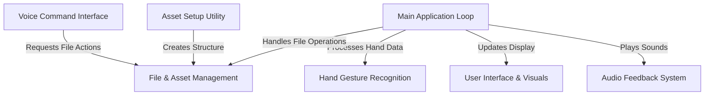
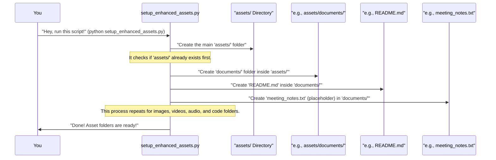

# Tutorial: ar-notes-opener

This project is an **augmented reality (AR) notes system** that lets you *interact with your files using natural hand gestures*. It allows users to **browse documents, images, videos, audio, and code** by showing a specific number of fingers for categories and file selection, and then *open chosen files* with a "thumbs up" gesture, all while seeing a live camera view with a clean on-screen interface and getting audio confirmations.


## Visual Overview



## Chapters

1. [Asset Setup Utility
](01_asset_setup_utility_.md)
2. [File & Asset Management
](02_file___asset_management_.md)
3. [Hand Gesture Recognition
](03_hand_gesture_recognition_.md)
4. [Voice Command Interface
](04_voice_command_interface_.md)
5. [Main Application Loop
](05_main_application_loop_.md)
6. [User Interface & Visuals
](06_user_interface___visuals_.md)
7. [Audio Feedback System
](07_audio_feedback_system_.md)

# Chapter 1: Asset Setup Utility

Welcome to the `ar-notes-opener` project! Imagine you have a new digital notebook, but instead of writing with a pen, you use hand gestures. Before you can start writing (or, in our case, organizing your digital files), you need a place to put everything. That's exactly where our first helper tool comes in: the **Asset Setup Utility**.

### What Problem Does It Solve?

Think of your computer files – documents, photos, videos, music, code. You probably have them scattered in different folders, right? For our `ar-notes-opener` system to work smoothly and find your files easily with gestures, it needs them organized in a very specific way.

If you had to create all those folders yourself (`documents`, `images`, `videos`, `audio`, `code`), it would be a bit tedious. You might even make a typo, and then the system wouldn't find your files! This is where the **Asset Setup Utility** shines.

**The big idea:** Instead of you manually creating folders like `assets/documents`, `assets/images`, etc., this utility does it for you automatically, so you can just focus on adding your files later!

### How to Use the Asset Setup Utility

This utility is a special script designed to get your project ready. It's like having a little helper that builds the foundation for your files.

Here’s how incredibly simple it is to use:

1.  **Open your command prompt or terminal.** This is where you type commands to your computer.
2.  **Navigate to your `ar-notes-opener` project folder.**
3.  **Run the setup command:**

    ```bash
    python setup_enhanced_assets.py
    ```

    This single line of code tells your computer to run the "Asset Setup Utility" script (`setup_enhanced_assets.py`).

**What happens when you run it?**

The script will quickly work its magic. You'll see a message like this:

```
Setting up asset folders and sample files...
Asset folders and sample files created successfully.
```

After it finishes, if you look inside your `ar-notes-opener` project folder, you'll now find a new main folder called `assets/`. Inside `assets/`, you'll see several other folders, each for a different type of file, along with special `README.md` files and some simple placeholder files.

Here's what the `assets` folder will look like:

```
assets/
├── documents/     (For your PDFs, Word files, text notes)
├── images/        (For your JPGs, PNGs, screenshots)
├── videos/        (For your MP4s, AVI clips)
├── audio/         (For your MP3s, WAV sounds)
└── code/          (For your Python scripts, HTML files)
```

Each of these subfolders also gets a `README.md` file (a simple text file that explains what kind of files go there) and a few dummy files so you can see how it works right away.

### How It Works Under the Hood (A Simple Peek)

Let's understand what's happening when you run that single command. It's like asking a construction worker (our script) to build a small house (our `assets` folder structure).



As you can see, the `setup_enhanced_assets.py` script systematically creates each required folder and places helpful files inside them. This ensures that the main AR Notes system, which we'll talk about later, knows exactly where to look for your content.

### A Closer Look at the Code

Let's peek at the `setup_enhanced_assets.py` file to see the core ideas behind how it builds these folders. Don't worry about understanding every detail; we'll focus on the main actions.

The script uses a special tool in Python called `os` (short for "operating system") to interact with folders and files on your computer.

1.  **Creating the main `assets` folder:**

    ```python
    import os

    def main():
        print("Setting up asset folders and sample files...")
        os.makedirs('assets', exist_ok=True) # Create 'assets' folder
        # ... rest of the code ...
    ```

    -   `import os`: This line brings in the `os` tool.
    -   `os.makedirs('assets', exist_ok=True)`: This is the key part. It tells your computer to create a folder named `assets`. The `exist_ok=True` part is a safety net; it means "if the folder already exists, don't worry, just continue."

2.  **Creating subfolders and READMEs:**

    The script has a helper function, `create_asset_folder`, that does this for each category:

    ```python
    # Inside setup_enhanced_assets.py
    def create_asset_folder(folder_name, description, extensions):
        folder_path = os.path.join('assets', folder_name)
        os.makedirs(folder_path, exist_ok=True) # Create the specific category folder

        readme_fp = os.path.join(folder_path, "README.md")
        with open(readme_fp, 'w', encoding='utf-8') as f:
            f.write(f"# {folder_name.capitalize()} Folder\n\n")
            # ... writes description and supported extensions ...
    ```

    -   `os.path.join('assets', folder_name)`: This smartly combines names like `'assets'` and `'documents'` to create the correct path, like `'assets/documents'`. This works correctly on all types of computers (Windows, Mac, Linux).
    -   `os.makedirs(folder_path, exist_ok=True)`: Again, this creates the specific folder (e.g., `documents`).
    -   `with open(readme_fp, 'w', encoding='utf-8') as f:`: This opens a new file named `README.md` inside the new folder. The `'w'` means "write" (create if it doesn't exist, or clear it if it does).
    -   `f.write(...)`: This writes the helpful text into the `README.md` file.

3.  **Adding sample files:**

    Another small helper function adds simple text files as placeholders:

    ```python
    # Inside setup_enhanced_assets.py
    def create_sample_file(folder_name, filename, content):
        full_path = os.path.join('assets', folder_name, filename)
        with open(full_path, 'w', encoding='utf-8') as f:
            f.write(content) # Writes the placeholder text

    # Example usage for documents folder in main()
    # create_sample_file("documents", "meeting_notes.txt", "# Meeting Notes...")
    # create_sample_file("documents", "project_proposal.txt", "# Project Proposal...")
    ```

    -   This is similar to how the `README.md` is created, but it creates files like `meeting_notes.txt` with some example content. These are just there to show you how the system will look for files. You can delete them and add your own later!

### Conclusion

In this chapter, we learned about the **Asset Setup Utility**, a super helpful tool that automatically builds the organized folder structure for your `ar-notes-opener` project. Instead of manually creating `documents/`, `images/`, `videos/`, `audio/`, and `code/` folders, you simply run `python setup_enhanced_assets.py`, and it does all the work for you. This ensures that the main system can easily find and manage your content.

Now that our file structure is perfectly set up, we're ready to dive into how the system actually manages and uses these files.

Let's move on to [Chapter 2: File & Asset Management](02_file___asset_management_.md)!

---

<sub><sup>Generated by [AI Codebase Knowledge Builder](https://github.com/The-Pocket/Tutorial-Codebase-Knowledge).</sup></sub> <sub><sup>**References**: [[1]](https://github.com/IshanG2111/ar-notes-opener/blob/01303747d8ac5941c6586d07a83304bf99357a11/README.md), [[2]](https://github.com/IshanG2111/ar-notes-opener/blob/01303747d8ac5941c6586d07a83304bf99357a11/assets/audio/README.md), [[3]](https://github.com/IshanG2111/ar-notes-opener/blob/01303747d8ac5941c6586d07a83304bf99357a11/assets/code/README.md), [[4]](https://github.com/IshanG2111/ar-notes-opener/blob/01303747d8ac5941c6586d07a83304bf99357a11/assets/documents/README.md), [[5]](https://github.com/IshanG2111/ar-notes-opener/blob/01303747d8ac5941c6586d07a83304bf99357a11/assets/images/README.md), [[6]](https://github.com/IshanG2111/ar-notes-opener/blob/01303747d8ac5941c6586d07a83304bf99357a11/assets/videos/README.md), [[7]](https://github.com/IshanG2111/ar-notes-opener/blob/01303747d8ac5941c6586d07a83304bf99357a11/setup_enhanced_assets.py)</sup></sub>

---

<sub><sup>Generated by [AI Codebase Knowledge Builder](https://github.com/The-Pocket/Tutorial-Codebase-Knowledge).</sup></sub>
